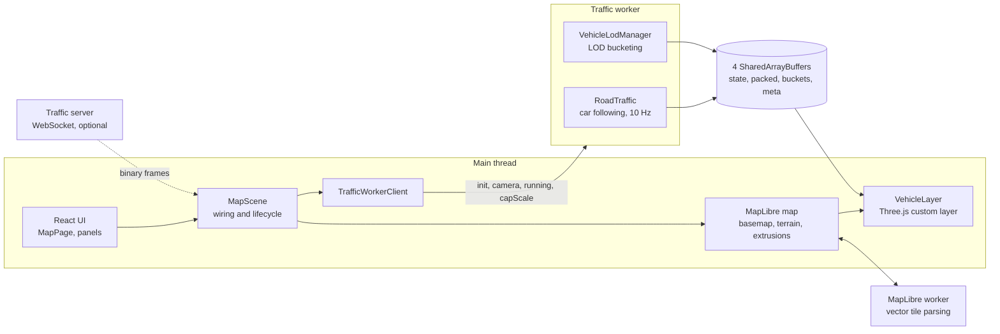
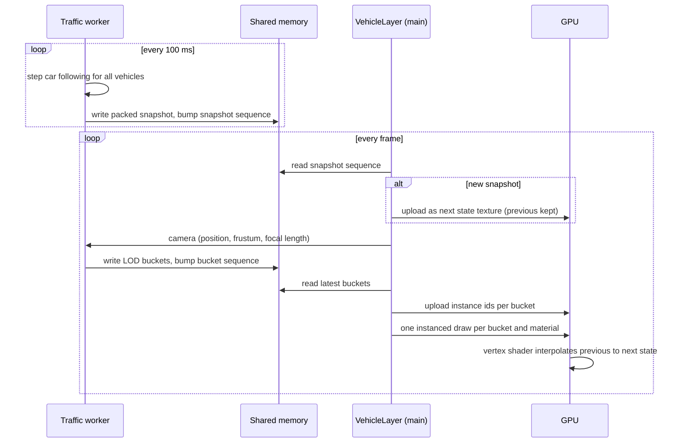

# System design

How the browser renders and simulates up to a million moving vehicles over a real city, and why
it is built this way. Coordinate conventions are in [coordinates.md](coordinates.md), and
measurements in [performance.md](performance.md) and [network.md](network.md).

## 1. Goals and constraints

**Goals**

- Render up to 1,000,000 vehicles on a real city map at the display's frame rate.
- Drive them along real roads with plausible car following, not random motion.
- Show every vehicle at the detail its screen size deserves, from a 146,000-triangle
  model up close to a single box far away.
- Accept vehicle state either from a local simulation or from a server feed.
- Run as a static site: no backend is required for the default experience.

**Constraints that shaped the design**

- The main thread also runs MapLibre and React, so per-vehicle work there has to be close
  to zero. Nothing creates a JavaScript object, `THREE.Mesh` instance or React component
  per vehicle; vehicle state lives in typed arrays.
- WebGL draw calls are expensive and GPU triangle throughput is finite, so vehicles are
  drawn with instancing, a handful of draw calls per frame, and a hard triangle budget.
- Web Mercator world coordinates exceed float32 precision at street level, so positions
  are stored relative to a per-city origin and the final matrix is composed in float64.

**Non-goals**

Traffic signals, lane changes, turn restrictions, pedestrians and routing to destinations
are out of scope for this prototype; section 15 lists them as next steps.

## 2. Architecture at a glance



Three threads share the work. The **main thread** owns the map, the UI and the vehicle
draw calls. The **traffic worker** owns the simulation and decides which vehicles get
which level of detail. The **MapLibre worker** fetches and parses basemap tiles. Vehicle
data crosses between them through shared memory, never through message copies.

## 3. Runtime components

| Component | Thread | Responsibility |
| --- | --- | --- |
| `MapPage` | Main | Toolbar, URL parameters, live statistics panel, vehicle inspector. Holds no per-vehicle state. |
| `MapScene` | Main | Creates the map, chooses the traffic source, loads assets, roads and terrain, and rebuilds itself when an option changes while keeping the camera. |
| MapLibre GL | Main and its worker | Basemap, labels, OSM building extrusions and the DEM-draped terrain mesh. |
| `VehicleLayer` | Main | A MapLibre custom layer that shares MapLibre's WebGL context and renders vehicles and 3D Tiles with Three.js. |
| `VehicleLodRenderer` | Main | One instanced mesh per LOD bucket and material; uploads state textures and instance id lists. |
| `CityTiles` | Main | OGC 3D Tiles through `3d-tiles-renderer`: PLATEAU for Tokyo, Cesium OSM Buildings via Cesium ion elsewhere. |
| `traffic.worker` | Worker | Runs `RoadTraffic` or, in network mode, only LOD bucketing. |
| `RoadNetwork`, `RoadTraffic` | Worker | Directed road graph and the car-following model. |
| `VehicleLodManager` | Worker | Projected-size buckets, hysteresis and nearest-first caps. |
| `WebSocketTrafficSource` | Main | Decodes server frames into the shared vehicle buffer and, with `?predict=1`, dead-reckons between them. |
| `traffic-server` | Node | Optional server that runs the same simulation and streams it. |

## 4. Data model and shared memory

**Vehicle state** is a Structure of Arrays in one buffer, 24 bytes per vehicle:

| Field | Type | Meaning |
| --- | --- | --- |
| `x`, `y`, `z` | float32 | Metres from the city origin: x east, y up, z south |
| `heading` | float32 | Compass heading, radians clockwise from north |
| `speed` | float32 | Metres per second |
| `type`, `color`, `flags` | uint8 | Vehicle type, palette index, state bits |

100,000 vehicles take 2.4 MB and a million 24 MB. Structure of Arrays keeps each pass over one field
sequential in memory, and each field maps directly onto a GPU texture channel.

**Four SharedArrayBuffers** connect the worker and the main thread:

| Buffer | Writer | Content |
| --- | --- | --- |
| `state` | Worker | The vehicle buffer above; the main thread reads it for picking and the inspector. |
| `packed` | Worker | Two slots of `(x, y, z, heading)` as RGBA float32, ready to upload as a texture. |
| `buckets` | Worker | Two slots of vehicle id lists, one region per LOD bucket, sized by that bucket's cap. |
| `meta` | Both | Int32 control words: sequence numbers, active slot, timings, per-bucket counts. |

The protocol is a lock-free double buffer. The producer fills the inactive slot, then
publishes it with `Atomics.store` on a sequence word. The consumer polls the sequence word
once per frame with `Atomics.load` and, if it changed, reads the slot it names. Neither
side ever waits, and a slow consumer simply skips snapshots.

## 5. The frame



The simulation ticks at 10 Hz, but vehicles move smoothly at 60 or 120 Hz because the
vertex shader interpolates between the previous and next state textures, including the
shortest-arc blend of headings. The CPU never computes a per-vehicle matrix: the shader
fetches the state by vehicle id, builds the rotation, and applies the float64-composed
model matrix.

MapLibre supplies the camera through `defaultProjectionData.mainMatrix`. The layer
recovers the eye position from its inverse and gives Three.js a perspective camera whose
projection reproduces that matrix, so 3D Tiles screen-space error and LOD selection see a
real camera.

## 6. Level of detail

Four meshes come out of the asset pipeline, plus a box for vehicles too small to show
any shape:

| Bucket | Triangles | Enters at projected size | Cap |
| --- | ---: | ---: | ---: |
| LOD0 | 146,000 | 220 px | 20 |
| LOD1 | 33,000 | 70 px | 300 |
| LOD2 | 5,400 | 18 px | 1,500 |
| LOD3 | 830 | 5 px | 8,000 |
| Box | 12 | 1.5 px | unlimited |

Vehicles smaller than 1.5 px are not drawn at all.

Selection uses the bounding sphere's projected diameter, not distance, so a zoomed-in
telephoto view gets detail where a wide view does not. A 10 % hysteresis band stops
flicker at thresholds, and vehicles already in a bucket get a small incumbent bonus.

Caps turn an unbounded scene into a fixed triangle budget. Each bucket keeps its nearest
vehicles, found with a counting sort by distance rather than a comparison sort, and
overflow falls to the next cheaper bucket. With every cap full the LOD meshes reach
27.5 million triangles, plus 12 per box. Traffic spread along real roads rarely fills
them: street views peak at 9.9 million triangles and 5 ms of GPU time at 100,000
vehicles. The million-instance benchmark packs its fleet into 3 km and does fill them,
which costs 26 ms of GPU time on an M1 Pro; that is the case `AdaptiveLod` exists for.
Drawing every vehicle at LOD3 instead costs 29 ms at 100,000 and 325 ms at 1,000,000.

`AdaptiveLod` watches frame time relative to the display's refresh period and scales all
caps down under pressure and back up when there is headroom. It estimates the period as
the 20th percentile of recent frame intervals, because a late frame is followed by an
early catch-up frame that would make the shortest interval misleadingly small.

## 7. Simulation

**Road graph.** `scripts/build-roads.ts` queries OpenStreetMap through Overpass for an
square around each city origin, 20 km for London and 8 km elsewhere, queried as 10 km
tiles to stay within Overpass limits, and writes a compact JSON of nodes and directed
edges with speed limits and road classes. `RoadNetwork` turns it into typed arrays in
compressed sparse row form, so every lookup is an index into a flat array.

**Car following.** `RoadTraffic` uses a simplified Intelligent Driver Model. Each tick it
groups vehicles by edge with a counting sort, orders each group leader first, and gives
every vehicle an acceleration that approaches its desired speed while keeping a safe
gap to the vehicle ahead, which may sit on the next edge. Nobody overtakes. Vehicles slow
before junctions, choose a random outgoing edge, and avoid immediate U-turns when they
can. The step allocates nothing.

**Lanes.** OSM describes a two-way road as one line. The graph holds one edge per
direction, and vehicles on two-way edges are offset 1.75 m to the driving side, left for
Tokyo, London and Hong Kong and right for New York. The offset is cosmetic; gaps are
still measured along the edge.

**Fleet size per city.** Road space, not the engine, limits the fleet: a network jams at
about its directed lane length divided by 6.5 m, a 4.5 m car plus a 2 m gap. Each city
therefore sets a ceiling and a default count. London's 20 km network has 10,098 km of
directed lanes, so a million cars average 10 m of lane each, congested but moving; it
defaults to 1,000,000. The 8 km networks of Tokyo, New York and Hong Kong hold 104,000 to
316,000 cars before jamming and stay at 100,000.

## 8. Geography: frame, terrain and buildings

**Local frame.** Each city has an origin. Positions are metres east, up and south of it,
held in float32, which keeps millimetre precision across a 20 km area. The transform
from local metres to Web Mercator and then to clip space is composed in float64 on the
CPU once per frame.

**Terrain.** With terrain on, MapLibre drapes the basemap over AWS Terrarium elevation
tiles. A custom protocol clamps them at sea level, because the raw tiles contain
bathymetry and coastal artefacts hundreds of metres deep. The same tiles are sampled once
per city into a height grid: 10 m from zoom 15 tiles for an 8 km area, 20 m from zoom 13
for London's 20 km, so the larger area costs no more to load. The worker stores an elevation per road node and
interpolates along edges, and the vehicle shader samples the grid again to snap each
vehicle to the ground and tilt it to the terrain normal, with the grade clamped at 1:4
against DEM artefacts. Local `y = 0` becomes sea level, and 3D Tiles are lifted by the
DEM height at the origin so both agree.

**Buildings.** Three modes are selectable: OSM extrusions from the vector basemap, the
default; OGC 3D Tiles; or none. Tokyo uses the open PLATEAU dataset. London, New York and
Hong Kong use Cesium OSM Buildings, which needs a Cesium ion token supplied at build time. An
opacity control fades whichever mode is shown without rebuilding the scene: it sets
`fill-extrusion-opacity` on the extrusion layers, or switches the tile materials to
blending, including tiles that stream in later. Vehicles are opaque and drawn first, so
they stay visible through faded buildings.

## 9. Network streaming

The same simulation can run in `server/traffic-server.ts` and stream to the browser over
a WebSocket. In that mode the browser decodes frames straight into the shared vehicle
buffer and the worker only does LOD bucketing.

| Format | Bytes per vehicle | Use |
| --- | ---: | --- |
| FULL | 12 | Keyframes: quantised position, heading, speed, type and colour |
| DELTA | 6 | Changes since the previous frame, with full corrections for respawns |
| VIEWPORT | 16 | Only vehicles inside the client's ground footprint, with ids |
| JSON | about 35 | Baseline for comparison only |

In viewport mode the client reports the ground footprint of its view frustum, limited to
the distance at which vehicles become boxes, and the server sends full-rate updates only
inside it, with a full keyframe every 2 s for the rest. That brings 100,000 vehicles at
10 Hz from 268 Mbit/s as JSON down to between 1 and 12 Mbit/s. The client slews its
render clock toward the server's instead of snapping, and with `?predict=1` it also
dead-reckons each vehicle from heading and speed between frames, so low update rates
stay smooth.

## 10. Offline pipelines

**Vehicle assets.** A headless Blender script turns the 653,000-triangle source model
into four LOD meshes with canonical material names, driven by a JSON config. The meshes
are then quantised and meshopt-compressed with gltf-transform, validated for size,
orientation and ground contact, and described in a `manifest.json` that the app reads
instead of hard-coding asset facts. The shader tints only the `paint` material per vehicle.

**Road graphs.** `scripts/build-roads.ts` produces one JSON file per city under
`assets/generated/roads/`. Both outputs are committed and copied into the build, so the
site needs no processing at load time.

## 11. Module layering

Dependencies point one way, and `dependency-cruiser` fails the build when they do not:

```text
pages / components / app      React UI
        |
       map                     MapLibre integration, scene wiring
        |
    rendering                  Three.js, shaders, LOD renderer
        |
 simulation | data | net       traffic, buffers, loaders, wire protocol
        |
 lod | geo | config | types    pure leaves, safe to import from workers and Node
```

Enforced rules include no cycles, no React in the engine layers, no rendering or UI
imports from simulation or workers, `types` as a pure leaf, standalone scripts, and a
server that may only import the pure layers. The traffic worker and the Node server
therefore share the simulation code without pulling in the browser.

## 12. Deployment

`npm run build` produces a self-contained static site of about 29 MB: the app, the
MapLibre and traffic workers, Draco and Basis decoders, the vehicle LODs and the road
graphs. It is hosted on Vercel.

`SharedArrayBuffer` requires cross-origin isolation, so every response carries
`Cross-Origin-Opener-Policy: same-origin`, `Cross-Origin-Embedder-Policy: require-corp`
and `Cross-Origin-Resource-Policy: cross-origin`. Third-party tiles still load because
MapLibre fetches them with CORS. Client-side routes fall back to `index.html`, but asset
paths do not, so a missing asset fails as a 404 instead of silently returning the page.

The MapLibre worker is bundled by Vite together with its shared chunk. Copying the
worker file alone leaves its import unresolved, which kills the worker and blanks the
basemap without any console error.

## 13. Degradation and failure modes

| Condition | Behaviour |
| --- | --- |
| No cross-origin isolation | Simulation and LOD selection run on the main thread. The vehicle layer then costs about 3 ms per frame instead of about 0.2 ms, and the simulation tick runs there too. |
| Frame time over budget | `AdaptiveLod` scales the LOD caps down until the display rate recovers. |
| No Cesium ion token | 3D Tiles are unavailable for London, New York and Hong Kong and the toolbar says why. OSM extrusions and Tokyo's tiles are unaffected. |
| Elevation tiles fail to load | Terrain is switched off for the session, the error is shown, and roads stay flat. |
| No road graph for a city | Vehicles fall back to synthetic motion in a square around the origin. |
| Server feed slows or pauses | With `?predict=1` vehicles dead-reckon from their last heading and speed; otherwise they hold their last reported position. |

## 14. Performance budget

Measured on an Apple M1 Pro; details in [performance.md](performance.md) and
[network.md](network.md).

| Measure | 100,000 vehicles, 8 km roads | 1,000,000 vehicles, London 20 km |
| --- | ---: | ---: |
| Frame rate | Display rate | 60 FPS at 60 Hz |
| Vehicle layer, main thread | 0.2–0.5 ms per frame | 0.1–0.2 ms, about 3 ms on snapshot frames |
| Simulation tick, worker, of 100 ms | 7–8 ms | 75–79 ms |
| LOD bucketing, worker | 1–4 ms | 8–9 ms |
| GPU, vehicles at street level | 2.7–5.1 ms | not timed; 2.6 M triangles |
| Streaming, viewport subscription at 10 Hz | 1.1–11.6 Mbit/s | not measured |

## 15. Scaling limits and next steps

- **Road space** limits the fleet first; a city needs about 6,500 km of directed lanes
  per million cars to avoid gridlock, and more to keep traffic moving.
- **Simulation** is the next limit. A million cars on London's 20 km graph take 75–79 ms
  of each 100 ms tick on one worker. Visiting only occupied edges, or splitting edges
  across two workers, restores headroom for slower CPUs.
- **Triangles** are capped by design; more vehicles add boxes, which are cheap.
- **Bandwidth** is the limit for server-driven traffic; viewport subscription keeps it
  proportional to what is on screen, not to the fleet size.
- **Next steps:** multiple vehicle types, traffic signals and turn logic, GPU picking,
  measurements on integrated and mobile GPUs, and a bridge to SUMO through the binary
  protocol.
